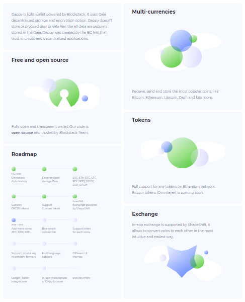

# Dappy (landing page markup)

Deployed version: [tppd67421.github.io/dappy](https://tppd67421.github.io/dappy/)

## Technologies used

- Gulp;
- SASS;
- Masonry (for grid).

## Project description

This project was be created from [dribbble template](https://dribbble.com/shots/5220215-Dappy-Freebie-Figma). All elements have interactive and css transition (buttons, links, etc). Page responsive for all screens.

On mobile version has hamburger menu.

Grid with main content was done with Mansory library.

